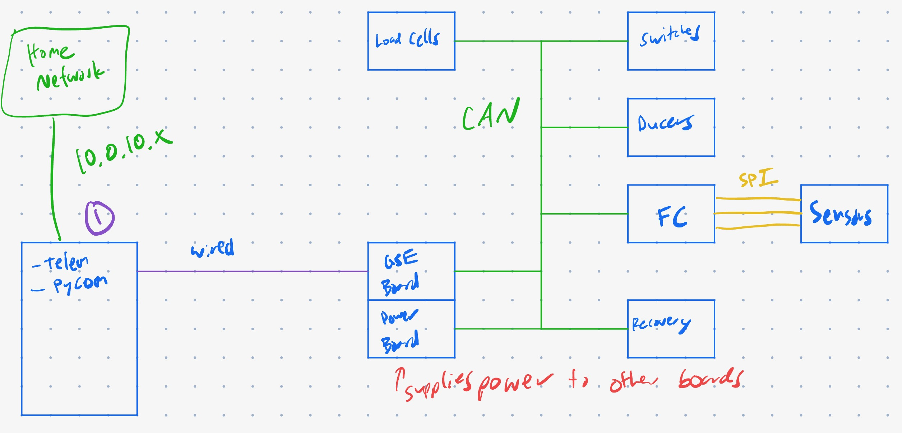

# Cesium
Library for all code related to development of my home server and space projects. 

The main goal of this project is not simply to learn, but to focus on following through and finishing each sprint. Additionally, with working prototypes and code, I plan to use my designs to help aspiring engineers who want to develop these skills as well (open-source, potentially?).

Each stage will act as a sort of version that had a fully working system. When I add changes that completely break a system, then I'll re-rev the design for a new version.

## Stage/Version 0 (Test Boards to get my footing)
* Rocket Project Test Rocket Backup Board (in case Avionics wants to fly another)
* ESP32 WROOM breakout with USB-UART communication, power circuit (3V3, 5V LDOs, Battery), and CAN Bus
* Breakout with sensors over I2C
* Breakout with sensors over SPI

## Stage/Version 1
The goal of this design is to create an assortment of avionics boards useful for ground testing of amateur rocketry or satellites using the CAN bus and various ADCs for data collection.

* ESP-32 Boards connected by CAN (for simplicity) 
  * CAN Transceiver - _MCP2562_ or _MCP2544FD_
* Boards designed to be small footprint and scaleable
    * Single function (i.e. Ducers, Load Cells, etc.)
* EGSE Board connects to server via D+/D- USB OTG (ESP32 S3 capability)
    * Future boards use _CP2102_ for USB-UART communication 
        * (ESP32 modules with ethernet do not have USB OTG)
* Telemetry
    * At this stage, unique codes for each telemetry
        * Based on CAN 11-bit arbitration ID for a maximum of 2048 different telemetries
    * EGSE board will act as the "router" between "support rack" and CAN bus boards
* List of Boards
    * Load Switches
        * FET switching, _INA180_ current sense, actuation feedback
        * Uses _ADS8688_ (optimized for single-ended signals)
    * Pressure Transducers
        * Uses _ADS8688_ (optimized for single-ended signals)
    * Load Cells
        * Uses _ADS1256_ (optimized for diffrential signals)
    * Flight Computer
        * SPI communication with IMU, GPS, and Altimeter  
    * Recovery board
        * Powering, arming, and receiving data from spare [Stratologger CF](http://www.perfectflite.com/SLCF.html) altimeter from my freshman year rocket class
    * EGSE/Power board
        * Routes CAN packets over USB to "support rack"
        * Commands from Python commander are sent to CAN bus
        
* GSE functionality (Python)
    * Commander (PyComm)
    * Telemetry visualization (Telem)

## Stage 2+
* ESP32 boards with wired Ethernet
    * PHY - _LAN8720AI_
    * Potential onboard switch - _KSZ8567S_
    * Separate VLAN to differentiate boards from home network
* Radio board for wireless communication
* Fully realize a proper home server/network diagram and organization
    * Firewall, different VLANs for things
    * Plex media server
    * My own local version of services called S-Suite (after G-Suite)
* GSE functionality (Python)
    * Real time DAQ (FizzVizz)
    * MySQL Integration for data storage
* Other software
    * Scheduler 
    * State Machine

## Other future ideas
* IOT Home Automation 
* Connecting my Octoprint 3D printers
